--- 

title       : Gene Expression & Growth in Budding Yeast 
subtitle    : X-Men Group Retreat, Bergen aan Zee, Nov 2016
author      : Rainer Machne
job         : 
framework   : io2012        # {io2012, html5slides, shower, dzslides, ...}
highlighter : highlight.js  # {highlight.js, prettify, highlight}
hitheme     : tomorrow      # 
widgets     : mathjax       # {mathjax, quiz, bootstrap}
mode        : selfcontained # {standalone, draft}
knit        : slidify::knit2slides

--- 

## Respiratory Oscillations in Budding Yeast 

ultradian|circadian
------|------
*Saccharomyces cerevisiae*| *Synechocystis* PCC6803
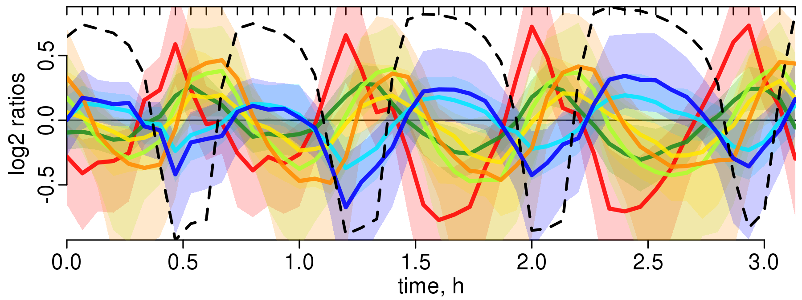|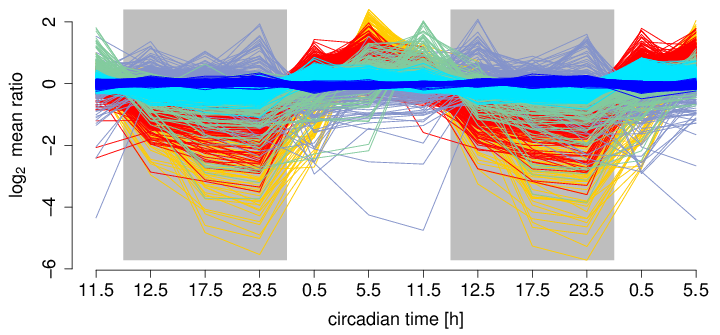
Paul, the *plateypus* and the stinky bug *E. coli* |Karl, the *segmenTier*
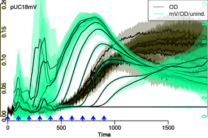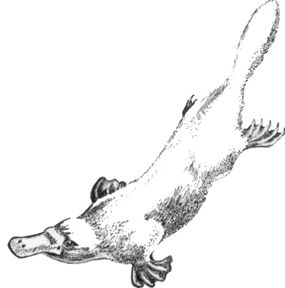|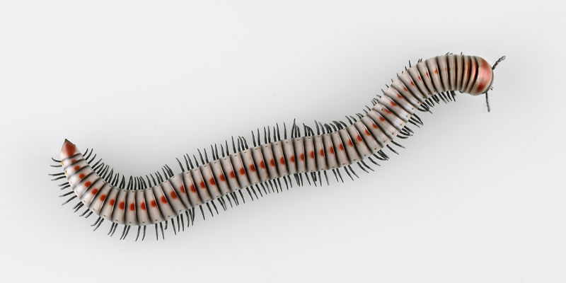

--- .class #id 

### *E. coli* Growth & Gene Expression

$$latex \begin{equation*} \begin{aligned}  X(t) &= X(0) \cdot e^{\mu\cdot t}\\t_2 &= \frac{\ln(2)}{\mu}  \end{aligned} \end{equation*} $$

--- .class #id 

### Varying Periods

observed periods|continuous culture
------|------
|
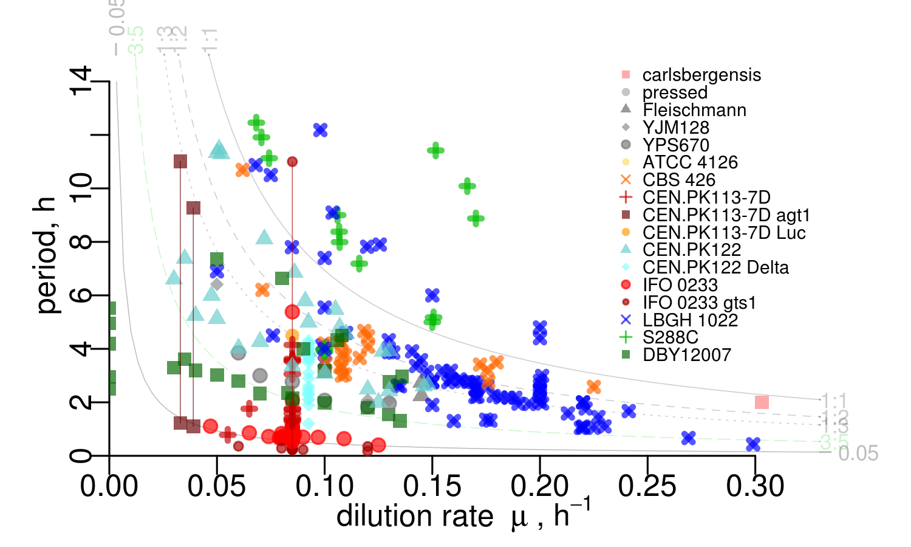|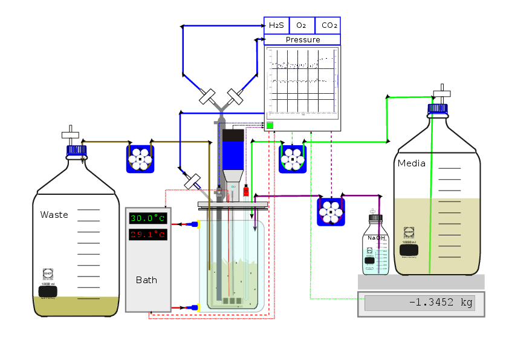
|
$$latex \begin{equation*} \begin{aligned} \frac{\text{d}X}{\text{d}t} &= + \mu X - \phi X  \\   \frac{\text{d}S}{\text{d}t} &= - \frac{\mu}{y} X + \phi (S_{in} - S)\\\hline \mu =& \mu_{max}\frac{S^n}{S^n+K^n};\; y = \frac{\Delta X}{\Delta S}  \end{aligned} \end{equation*} $$ |  at steady state: $$\mu = \phi$$ growth rate = dilution rate

--- .class #id 

### Varying Periods

observed periods|the budding cycle
------|------
|
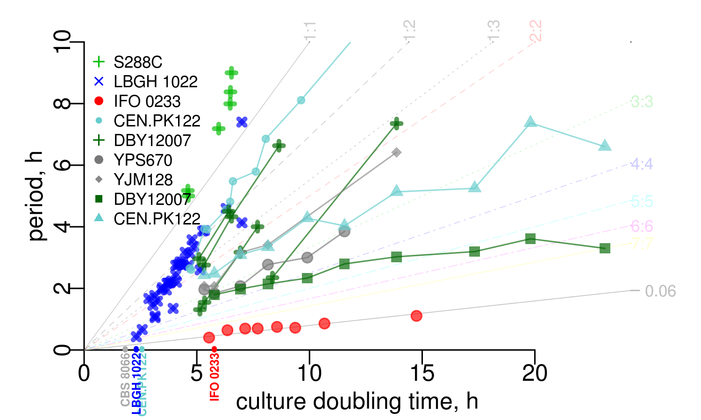| 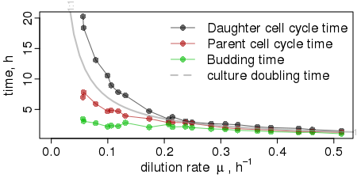
|
$$\begin{equation*} \begin{aligned}X(t) &= X(0) \cdot e^{\mu\cdot t}\\t_2 &= \frac{\ln(2)}{\mu} \end{aligned} \end{equation*}$$|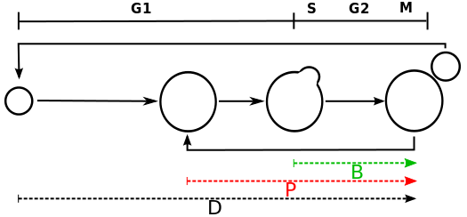

--- .class #id

### Varying Periods ... Constant Gene Expression Profile

Observed periods| | | |
---|---|---|---
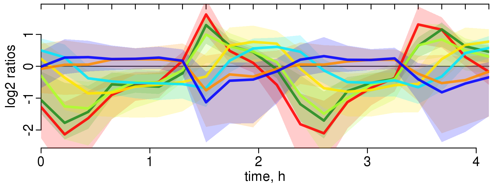|CEN.PK 122  $$0.13\; \text{h}^{-1}$$ | 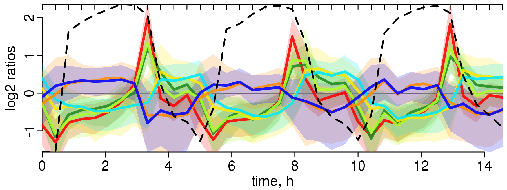| CEN.PK 122 $$0.1\;\text{h}^{-1}$$ 
|  IFO 0233 $$0.09\;\text{h}^{-1}$$ | 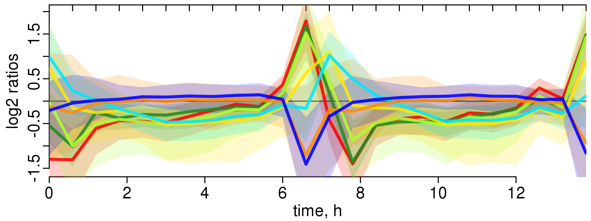| CEN.PK 122 $$0.05\;\text{h}^{-1}$$
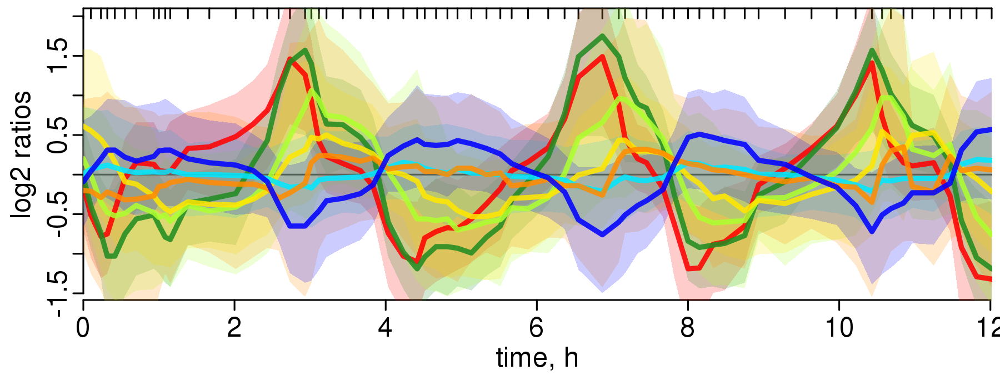| DBY12007 $$\sim \textbf{0}\;\text{h}^{-1}$$ |  
Oscillation without (much) cell division!

 

$$\rightarrow \text{live at the brink}$$

--- .class #id 

### Gene Expression : function
 

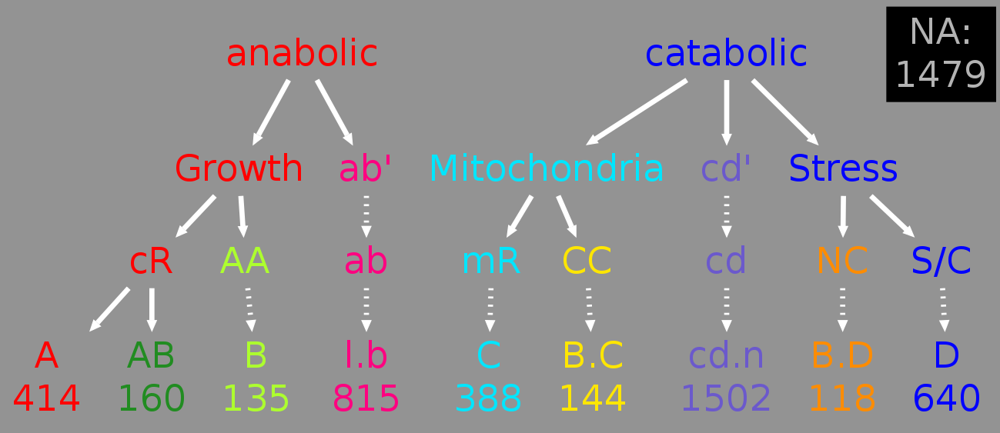

 

Machne & Murray, PLoS ONE 2012 

--- .class #id 

### Gene Expression : meta-transcriptome
 

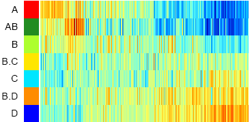

 

Machne & Murray, PLoS ONE 2012 

--- .class #id 

### Gene Expression & Growth Laws
 

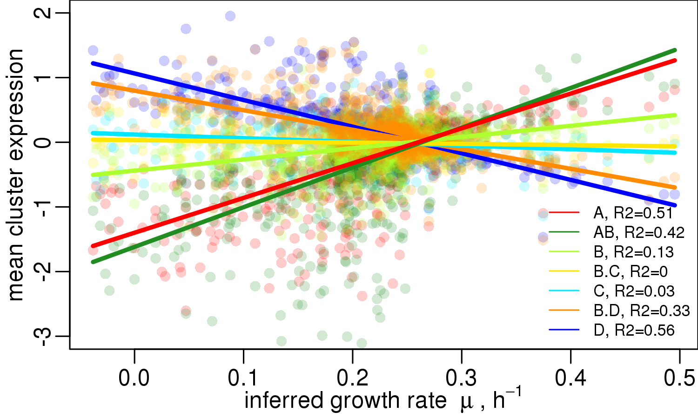

 

Machne & Murray, PLoS ONE 2012 
Slavov et al., Mol Biol Cell 2011

--- .class #id 

### Gene Expression & Growth Laws
 

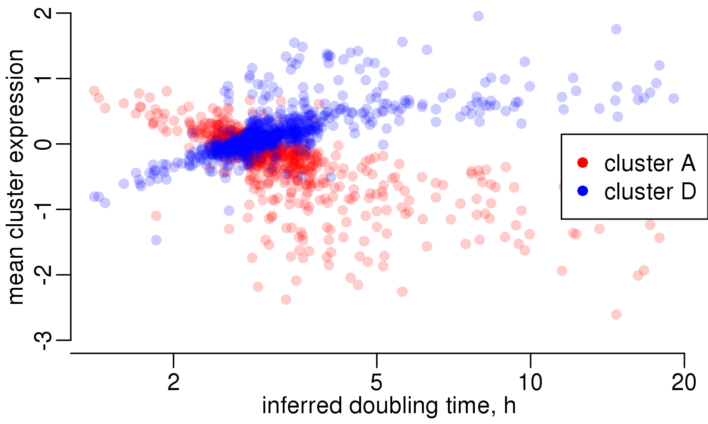

 

Machne & Murray, PLoS ONE 2012 
Slavov et al., Mol Biol Cell 2011

$$t_2=\frac{\ln(2)}{\mu}$$

--- .class #id 

### Growth Laws: linear relations to *&mu;*

major carbon flux| nucleic acid content
------|------

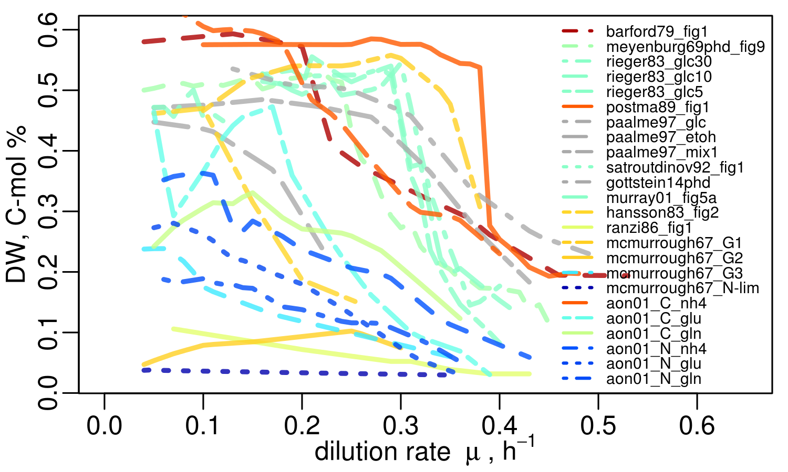
|
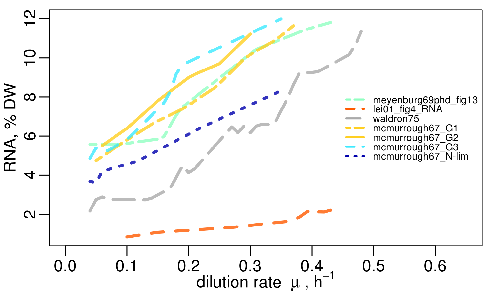

|

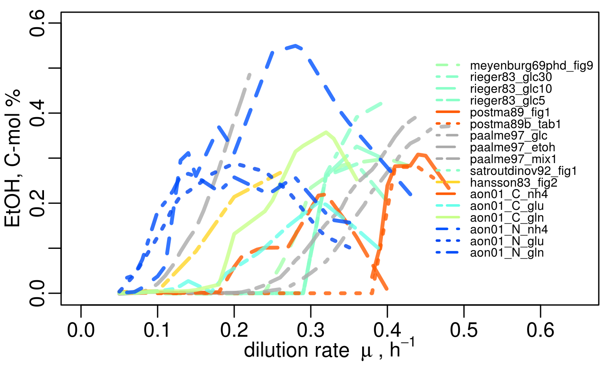
|
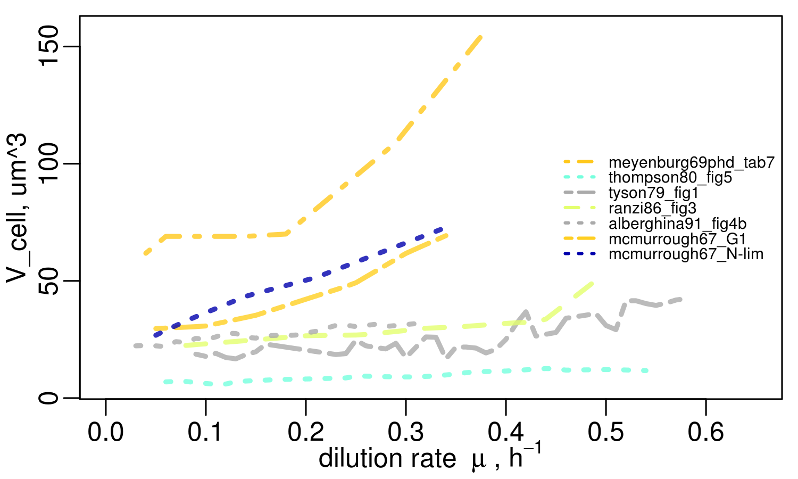

koch1988, &mu; = rib2
heijnen92: limiting is membrane space
recent trade-off models: protein costs

--- .class #id 

### A Working Hypothesis: Life's Fundamental Feedbacks

culture level|cellular level
---|---
|
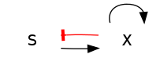|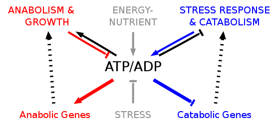

$$   \begin{equation*}
    \label{eqn:ancat}
    \begin{aligned}
      \frac{\text{d}X}{\text{d}t} &= (\mu_{ab} - \phi) X  \\
      \frac{\text{d}S}{\text{d}t} &= \phi (S_{in} - S)-(\mu_{ab} + \mu_{cd}) X\\  
      \frac{\text{d}atp}{\text{d}t} &= (n_{cd} \mu_{cd} - n_{ab} \mu_{ab} - \mu_{m})\frac{C_c}{V_c} - \mu_{ab} atp\\
      adp & = a_{tot} - atp\\\hline
     \end{aligned}
  \end{equation*} $$

-> model yeast/coilseq - sequence-dependence of DNA state!

--- .class #id 

## Growth & Stress

red/blue genes in batch growth:

yeast diauxie: expo phase is not "balanced", slow transition, atp-model?

blue genes!? phase of low energy, stress, differentiation 

--- .class #id 

### Stress & Cell Structure 

[//]: # (Comment )

cells are well prepared for stress: differentiation

stress: P-bodies form, cell becomes granular, phase-transition

show osci water structure paper

--- .class #id 

### Stress & Chromatin

amariei: three phases of nucleosome condensation

--- .class #id 

### Working Hypothesis: Chromatin Remodeling

-> model chromatin remodeling, but ATP/ADP general, electron transport chain

--- .class #id 

### Stress & Pervasive Transcription in Yeast

RNAseq data!

noncoding, antisense expression: only during low energy phase

upstream noncoding: detected by Karl, segmenTier, potentially new mechanism
after yeast WGD

--- .class #id 

## THE END

concepts and tools for cyano/bacteria, coilseq

--- .class #id 

