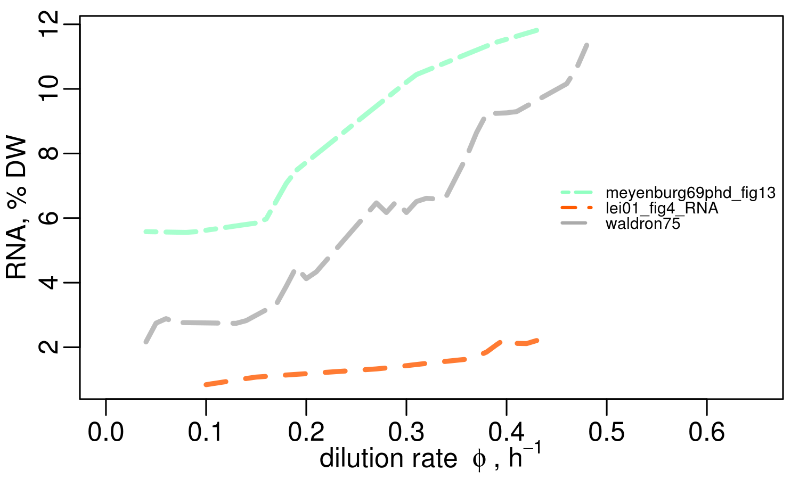
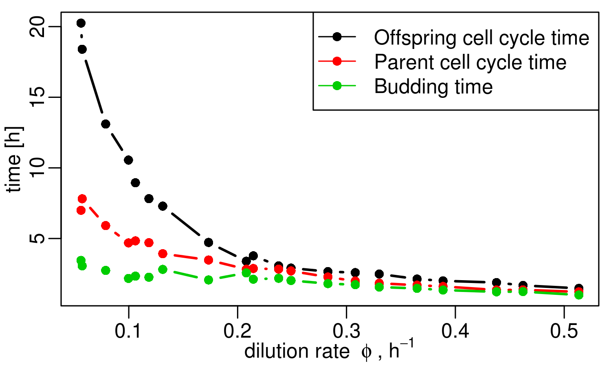
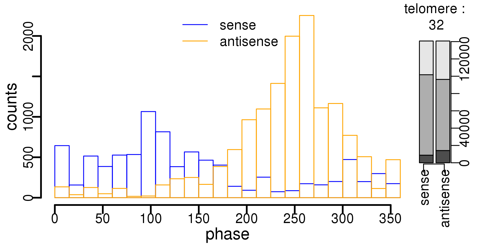

--- 

title       : Gene Expression & Growth  in Budding Yeast 
subtitle    : X-Men Group Retreat, Bergen aan Zee, Nov 2016
author      : Rainer Machne
job         : 
framework   : io2012        # {io2012, html5slides, shower, dzslides, ...}
highlighter : highlight.js  # {highlight.js, prettify, highlight}
hitheme     : tomorrow      # 
widgets     : mathjax       # {mathjax, quiz, bootstrap}
mode        : selfcontained # {standalone, draft}
knit        : slidify::knit2slides

--- 

## Respiratory Oscillations in Budding Yeast 

ultradian|circadian
------|------
*Saccharomyces cerevisiae*| *Synechocystis* PCC6803
|
*E. coli*  & Paul, the *plateypus*|RNA-seq & Karl, the *segmenTier*
|

--- .class #id 

### Growth & Gene Expression in *E. coli* 

$$latex 
\begin{equation*} \begin{aligned}  
\frac{\text{d}X(t)}{\text{d}t} =& \mu X(t)\\ 
X(t) =& X(0)   e^{\mu  t}\\ 
t_D =& \frac{\ln(2)}{\mu}  
\end{aligned} \end{equation*} $$

 
https://github.com/raim/platexpress or Paul, the *plateypus*?

--- .class #id 

### Growth & Gene Expression in *E. coli* 

$$latex 
\begin{equation*} \begin{aligned}  
\frac{\text{d}X(t)}{\text{d}t} =& \mu X(t)\\ 
X(t) =& X(0)   e^{\mu  t}\\ 
t_D =& \frac{\ln(2)}{\mu}  
\end{aligned} \end{equation*} $$

 
https://github.com/raim/platexpress or Paul, the *plateypus*?

--- .lineheight

#### Varying Periods

continuous culture|observed periods
------|------
|
|
|
in continuous culture: $$latex \begin{equation*} \begin{aligned} \frac{\text{d}X(t)}{\text{d}t} =& \mu X(t)- \phi X(t) \end{aligned} \end{equation*} $$  | at steady state: $$\mu = \phi$$  

  
Monod, Annual Review of Microbiology 1949: *The Growth of Bacterial Cultures.* 
Finn & Wilson, J Agric Food Chem 1954: *Population Dynamics of a Continuous Propagator for Microorganisms.*

--- .lineheight

#### Varying Periods at Balanced Growth

continuous culture|observed periods
------|------
|
|
|
$$latex \begin{equation*} \begin{aligned} \frac{\text{d}X(t)}{\text{d}t} =& \mu X(t)- \phi X(t) \\ \frac{\text{d}S(t)}{\text{d}t} =&  \phi (S_{in} - S(t)) - \frac{\mu}{Y} X(t) \end{aligned} \end{equation*} $$| $$\mu = \mu_{max}\frac{S^n}{S^n+K^n}$$ $$Y = \frac{\Delta X}{\Delta S}  $$

  
Monod, Ann Rev Microbiol 1949: *The Growth of Bacterial Cultures.* 
Finn & Wilson, J Agric Food Chem 1954: *Population Dynamics of a Continuous Propagator for Microorganisms.* 
Mochan & Pye, Nature New Biol 1973: *Respiratory oscillations in adapting yeast cultures.* 
Heinzle *et al.*, 1983: *Modelling of sustained oscillations observed in continuous culture of Saccharomyces cerevisiae.*

--- .lineheight

#### Varying Periods & the Cell Cycle?

the budding cycle|observed periods
------|------
|
 |
|
|$$\begin{equation*} \begin{aligned}t_D &= \frac{\ln(2)}{\mu} \\ \frac{t_O}{2} = t_P &= \frac{\ln\frac{1+\sqrt{5}}{2}}{\mu} \end{aligned} \end{equation*}$$

Thompson & Wheals, J Gen Microbiol 1980: *Asymmetrical division of Saccharomyces cerevisiae in glucose-limited chemostat culture.* 
Duboc, Philippe & von Stockar, Chem Eng Sci 2000: *Modeling of oscillating cultivations of Saccharomyces cerevisiae* [...]. 
Klevecz *et al.*, PNAS 2004: *A genomewide oscillation in transcription gates DNA replication and cell cycle.*

--- .class #id

#### Varying Periods ... Constant Gene Expression Profile

Observed periods| | | |
---|---|---|---
|CEN.PK 122 \(\phi=0.13\;\text{h}^{-1}\) \(t_D=5.3\;\text{h}\) \(t_{osc}=2\;\text{h}\) | | CEN.PK 122 \(\phi=0.1\;\text{h}^{-1}\)  \(t_D=6.9\;\text{h}\)  \(t_{osc}=5\;\text{h}\)
|  IFO 0233 \(\phi=0.09\;\text{h}^{-1}\) \(t_D=7.7\;\text{h}\)  \(t_{osc}=0.7\;\text{h}\) | | CEN.PK 122 \(\phi=0.05\;\text{h}^{-1}\) \(t_D=13.9\;\text{h}\)  \(t_{osc}=7\;\text{h}\)
  
Oscillation without (much) cell division:
 | | | DBY12007 \(\phi= \sim \textbf{0}\;\text{h}^{-1}\)  \(t_D=\infty \;\text{h}\)  \(t_{osc}=4\;\text{h}\)

 

$$\rightarrow \text{live at the brink}$$

--- .lineheight .centertext

### Gene Expression : function
 

 
based on *gene ontology* analysis

  

Murray <em>et al.</em>, PNAS 2007: <em>Regulation of yeast oscillatory dynamics.</em> 
Machne & Murray, PLoS ONE 2012: <em>The yin and yang of yeast transcription:  elements of a global feedback system between metabolism and chromatin.</em>

--- .lineheight .centertext

### Gene Expression : meta-transcriptome
 

 
cluster gene expression in ~1300 microarray experiments

  

Murray <em>et al.</em>, PNAS 2007: <em>Regulation of yeast oscillatory dynamics.</em> 
Machne & Murray, PLoS ONE 2012: <em>The yin and yang of yeast transcription:  elements of a global feedback system between metabolism and chromatin.</em>

--- .lineheight .centertext

### Gene Expression & Growth Laws
 

 
\(\mu \sim \frac{\text{red genes}}{\text{blue genes}}\)

 

 
Brauer <em>et al.</em>, Mol Biol Cell 2008: <em>Coordination of growth rate, cell cycle, stress response, and metabolic activity in yeast.</em> 
Slavov <em>et al.</em>, Mol Biol Cell 2011: <em>Coupling among growth rate response, metabolic cycle, and cell division cycle in yeast.</em> 

--- .lineheight .centertext

### Gene Expression & Growth Laws
 

 
\(\mu = k \frac{\text{ribosomes}}{\text{proteins}}\)

 

 
Brauer <em>et al.</em>, Mol Biol Cell 2008: <em>Coordination of growth rate, cell cycle, stress response, and metabolic activity in yeast.</em> 
Slavov <em>et al.</em>, Mol Biol Cell 2011: <em>Coupling among growth rate response, metabolic cycle, and cell division cycle in yeast.</em> 
<b>Koch, Can J Microbiol 1988: <em>Why can't a cell grow infinitely fast?</em></b> 

--- .lineheight .centertext

### Gene Expression & Growth Laws
 

 
\(\mu = k \frac{\text{ribosomes}}{\text{proteins}}\)

 
Brauer <em>et al.</em>, Mol Biol Cell 2008: <em>Coordination of growth rate, cell cycle, stress response, and metabolic activity in yeast.</em> 
Slavov <em>et al.</em>, Mol Biol Cell 2011: <em>Coupling among growth rate response, metabolic cycle, and cell division cycle in yeast.</em> 
<b>Koch, Can J Microbiol 1988: <em>Why can't a cell grow infinitely fast?</em></b> 
Scott <em>et al.</em>, Mol Syst Biol 2014: <em>Emergence of robust growth laws from optimal regulation of ribosome synthesis.</em> 
Wei&szlig;e <em>et al.</em>, PNAS 2015: <em>Mechanistic links between cellular trade-offs, gene expression, and growth.</em>

--- .centertext .lineheight

### Gene Expression & Growth Laws
 

 
\(t_D=\frac{\ln(2)}{\mu}\)

 

 
Slavov <em>et al.</em>, Mol Biol Cell 2011: <em>Coupling among growth rate response, metabolic cycle, and cell division cycle in yeast.</em> 
Burnetti, Aydin & Buchler, Mol Biol Cell 2016: <em>Cell cycle Start is coupled to entry into the yeast metabolic cycle across diverse strains and growth rates.</em>

---  .lineheight

major carbon flux| nucleic acid content|cell
---|---|---
||
||
||

 
With increasing growth rate *&mu;*:  
higher RNA & lower DNA content; larger cells, lower biomass & higher ethanol yield!

  
 
<b>Koch, Can J Microbiol 1988: *Why can't a cell grow infinitely fast?*</b> 
Schaechter, Maaloe & Kjeldgaard, J Gen Microbiol 1958: *Dependency on medium and temperature of cell size and chemical composition during balanced growth of Salmonella typhimurium.* 
Heijnen & Van Dijken, Biotechnol Bioeng 1992: *In search of a thermodynamic description of biomass yields* [...]. 
Wei&szlig;e *et al.*, PNAS 2015: *Mechanistic links between cellular trade-offs, gene expression, and growth.*

---  &twocol .lineheight

*** =left
#### Summary: Growth & Gene Expression
 

1. Growth Rate vs. Protein Expression Trade-off
2. Respiratory Oscillation: 
\(t_{osc} \sim  t_D\), but <b>no strict coupling!</b>
3. Anti-correlation: Red \(\leftrightarrow\) Blue Genes
4. Relative Red/Blue Gene Expression 
\(\mu = k \frac{\text{red genes}}{\text{blues genes}}\)  
and with <b>major cellular restructuring</b>

*** =right
#### A Working Hypothesis: Life's Fundamental Feedbacks
  

$$   \begin{equation*}
    \label{eqn:ancat}
    \begin{aligned}
      \frac{\text{d}X}{\text{d}t} &= (\mu_{ab} - \phi) X  \\
      \frac{\text{d}S}{\text{d}t} &= \phi (S_{in} - S)-(\mu_{ab} + \mu_{cd}) X\\  
      \frac{\text{d}atp}{\text{d}t} &= (n_{cd} \mu_{cd} - n_{ab} \mu_{ab} - \mu_{m})\frac{C_c}{V_c} - \mu_{ab} atp\\
      adp & = a_{tot} - atp\\\hline
     \end{aligned}
  \end{equation*} $$

  

--- .lineheight

diauxic growth|metabolism
---|---
|
|
|
|

 
Zampar *et al.*, Mol Syst Biol 2013: *Temporal system-level organization of the switch from glycolytic to gluconeogenic operation in yeast.* 

--- .lineheight

diauxic growth|cell cycle
---|---
|
|
|
|

 
Zampar *et al.*, Mol Syst Biol 2013: *Temporal system-level organization of the switch from glycolytic to gluconeogenic operation in yeast.* 
Brauer *et al.*, Mol Biol Cell 2005: *Homeostatic adjustment and metabolic remodeling in glucose-limited yeast cultures.*

--- .lineheight

diauxic growth|metabolism
---|---
|
|
|
|

 
Zampar *et al.*, Mol Syst Biol 2013: *Temporal system-level organization of the switch from glycolytic to gluconeogenic operation in yeast.* 
Brauer *et al.*, Mol Biol Cell 2005: *Homeostatic adjustment and metabolic remodeling in glucose-limited yeast cultures.* 
Slavov *et al.*, Cell Rep 2014: *Constant growth rate can be supported by decreasing energy flux and increasing aerobic glycolysis.*

--- .lineheight

diauxic growth|transcription
---|---
|
|
|
|

 
Zampar *et al.*, Mol Syst Biol 2013: *Temporal system-level organization of the switch from glycolytic to gluconeogenic operation in yeast.* 
Brauer *et al.*, Mol Biol Cell 2005: *Homeostatic adjustment and metabolic remodeling in glucose-limited yeast cultures.* 
Slavov *et al.*, Cell Rep 2014: *Constant growth rate can be supported by decreasing energy flux and increasing aerobic glycolysis.*

--- .lineheight

stress|translation vs. P-bodies
---|---
|
|
|
|

 
Slavov *et al.*, Cell Rep 2014: *Constant growth rate can be supported by decreasing energy flux and increasing aerobic glycolysis.* 
Zid & O'Shea, Nature 2014: *Promoter sequences direct cytoplasmic localization and translation of mRNAs during starvation in yeast.*

--- &twocolbigright

### Gene Expression & Chromatin
*** =left

*** =right

ATP/ADP ratio oscillates

ATP-dependent Nucleosome Remodeling

--- &twocolbigright

### Gene Expression & Chromatin
*** =left

*** =right

ISW2 enriched in blue gene promoters

ATP-dependent Nucleosome Remodeling

--- &twocolbigright

### Gene Expression & Chromatin
*** =left

*** =right

Increased occupancy of blue genes in RSC k.o.

ATP-dependent Nucleosome Remodeling

--- &twocolbigright

### Stress & Chromatin

*** =left

*** =right

--- .lineheight
 
### Stress & Chromatin

Amariei *et al*, Microb Cell 2014: *Time resolved DNA occupancy dynamics during the respiratory oscillation uncover a global reset point in the yeast growth program.*

--- .class #id 

Global behaviour similar, but locally different consequences! 
Sequence-dependence of nucleosome occupancy and rotational positioning.

 

Nocetti & Whitehouse, GenesDevel 2016: *Nucleosome repositioning underlies
dynamic gene expression.* \(\Leftarrow\) didn't cite us :(

--- &twocolbigright

### 

*** =right

Upstream ncRNA SRG1 regulates SER3, but not in SER33 
\(\Rightarrow\) potentially new mechanism after yeast WGD

*** =left
1. RNA-seq time-series: get read-counts

2. Pre-segment, <50 kb

3. Cluster each read-count: 
take DFT, scale, cluster (`kmeans`)

4. Dynamic Programming:  `icor`, `ccor`

--- &twocol

### Pervasive Transcription During Low Energy Phase!

*** =left

*** =right

--- &twocol

### Pervasive Transcription During Low Energy Phase!

*** =left

*** =right

--- &twocol

### Pervasive Transcription During Low Energy Phase!

*** =left
  

Non-coding transcription, including anti-sense is heavily
biased to the blue gene phase, where ATP/ADP is low. 

<b>Experimental transcription as a 
substrate for evolution?</b>

*** =right

--- .class #id 

## THE END

* Lots of data: 
Concepts and tools for cyano/bacteria, Coil-seq

* Trade-off between growth rate &mu; and (recombinant) gene expression

* Chromatin structure can act as a global regulator
of transcription (growth laws!)

* Cells may generate substrate for selection: 
a `weak lamarckian` mechanism of evolution that has
already been suggested by Darwin

* Thanks

